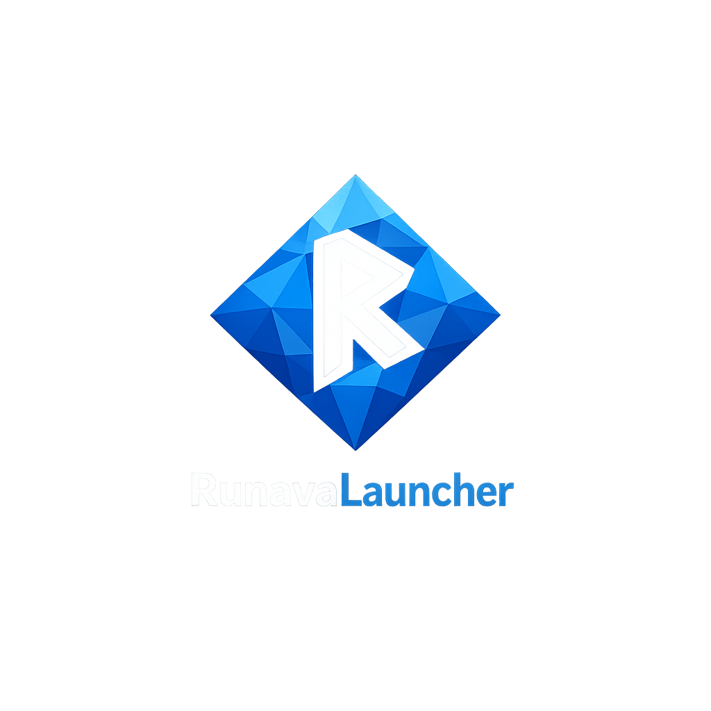
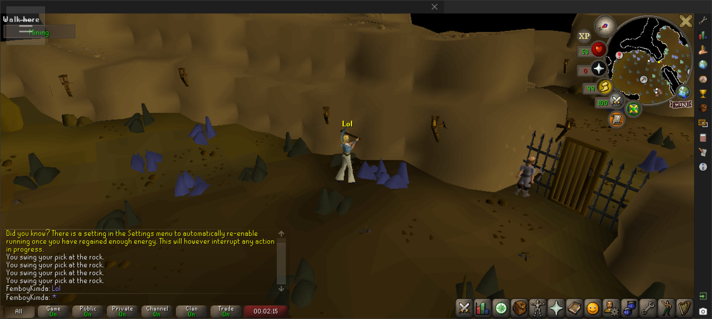

<p align="center">
  
</p>

<p align="center"><em>The desktop RuneLite client, running on Android.</em></p>

<p align="center">
  <a href="https://github.com/sturq/RunavaLauncher/actions/workflows/android.yml"></a>
  <a href="https://github.com/sturq/RunavaLauncher/releases/latest"></a>
</p>

RunavaLauncher is a single-APK port of the desktop [RuneLite](https://runelite.net/) client - the open-source third-party Old School RuneScape client - to Android. It launches the upstream RuneLite JAR inside a JRE 25 packaged with the app and renders it through a software AWT pipeline (Caciocavallo TTA), so you get the same RuneLite UI and the same plugin ecosystem you have on desktop, on your phone, without proot, without X11, without a separate runtime install.

Everything is bundled. Install one APK, tap the icon, log in, play.



## Install

Grab the latest APK from the [releases page](https://github.com/sturq/RunavaLauncher/releases/latest) and sideload it. ~125 MB, arm64-v8a only.

## What works

* Full RuneLite client - login, world hop, chat, walking, combat, plugins, everything
* The entire RuneLite plugin sidebar - same versions as desktop
* **Audio** - sound effects, music, plugin sounds, through Android's AAudio output
* **Both orientations** - the game reflows when you rotate the device, no bars or stretching
* Touch controls for camera, taps, right-click, pinch-zoom
* Fullscreen, immersive layout; system gestures excluded from the right-edge UI strip
* Survives backgrounding - switch apps, take a call, come back, the game is still running
* Material You themed launcher icon

## Known limitations

* **Software-rendered.** RuneLite's GPU plugin (`librlawt.so`) needs glibc + X11 + GLX symbols that Android doesn't have. The CPU renderer is what runs. Frame rate is fine on a modern phone, but you won't hit desktop GPU-plugin numbers.
* **Portrait is tight.** RuneLite's UI is built for landscape; in portrait everything reflows to fit, but the sidebar is necessarily narrower.

## Touch controls

| Gesture | Action |
| --- | --- |
| 1-finger tap | Left click |
| 1-finger long-press (≥ 200 ms, no movement) | Right click (opens OSRS context menu) |
| 1-finger drag in game world (left ~75% of screen) | Camera rotate (arrow keys) |
| 1-finger drag on RuneLite UI (right sidebar) | Left button held - inventory drag, minimap drag, etc. |
| 2-finger drag | Camera rotate (arrow keys) |
| 2-finger pinch | Zoom in / out (mouse wheel) |
| ☰ menu (top-left) | Drawer: keyboard, copy/paste, virtual mouse toggle, log viewer, force-close |

Starting a camera drag also re-focuses the OSRS canvas, so arrow keys still rotate the camera even with the plugin search field open.

## Building

```bash
./gradlew :app_pojavlauncher:assembleMainDebug
# APK at: app_pojavlauncher/build/outputs/apk/main/debug/app_pojavlauncher-main-debug.apk
```

GitHub Actions builds a debug APK on every push and on a daily 04:00 UTC cron. The "latest" release tag is updated automatically from `main`.

## Architecture

Fork of [PojavLauncher](https://github.com/PojavLauncherTeam/PojavLauncher) / Amethyst-Android, gutted down to the JVM-hosting path. From upstream:

* FCL-Team's OpenJDK 25 for Android (`aarch64`, embedded as a JRE tar.xz in `assets/components/jre-25/`). AngelAuraMC's JDK 17 and 21 both have a JNI handle-list bug in their `libjvm.so` that fires under Cacio's AWT peer calls - FCL-Team is a different OpenJDK port and dodges it.
* Caciocavallo TTA as the AWT toolkit (no X11)
* JNI glue that translates Cacio's AWT frame output into a software-rendered bitmap on a `TextureView`

Added or rewritten for RuneLite:

* `RuneLiteLauncherActivity` - downloads the upstream RuneLite JAR on first launch, deduplicates entries, caches it, installs JRE 25, fires the game intent
* `RuneLiteGameActivity` - fullscreen game-style host, touch → AWT mouse/key mapping, drawer-based menu, foreground-service keepalive, dynamic JFrame resizing on rotation
* `runelite_audio/` - a `javax.sound.sampled.spi.MixerProvider` on the JVM boot classpath. Per-line ring buffers in Java; one shared AAudio output stream; software mix in a low-priority pump thread. `write()` never blocks the EDT.
* `runelite_window_agent/` - Java agent loaded via `-javaagent`. Sizes the RuneLite JFrame to the current orientation's visible aspect, repaints the frame at 10 Hz so plugin sidebar icons don't go stale, refocuses the OSRS canvas on each camera drag, and runs a file-based IPC poller for mouse-wheel / right-click / RESIZE / FOCUSGAME events that Cacio's input bridge doesn't handle directly.

The `:runelitegame` Android process is separate from `:launcher` and is kept alive by a foreground service so Android doesn't reap the JVM mid-session.

## License

GPL-3.0, inherited from upstream PojavLauncher. RuneLite itself is BSD-2-Clause and is downloaded at runtime, not bundled.

## Credits

* [RuneLite](https://github.com/runelite/runelite) - the actual client
* [PojavLauncher](https://github.com/PojavLauncherTeam/PojavLauncher) - the JVM-on-Android scaffolding
* [Amethyst-Android](https://github.com/AngelAuraMC/Amethyst-Android) - the PojavLauncher fork this codebase started from
* [Caciocavallo](https://github.com/CaciocavalloSilano/caciocavallo) - pure-Java AWT toolkit, no X11 required
* [FCL-Team/Android-OpenJDK-Build](https://github.com/FCL-Team/Android-OpenJDK-Build) - the OpenJDK 25 port for Android we bundle

Not affiliated with Jagex or the RuneLite project. Use of RuneLite is subject to Jagex's third-party client guidelines.
